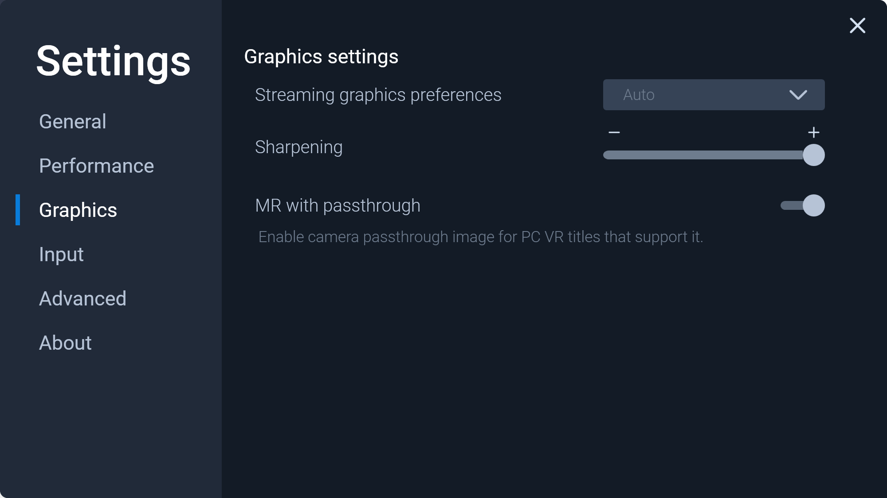
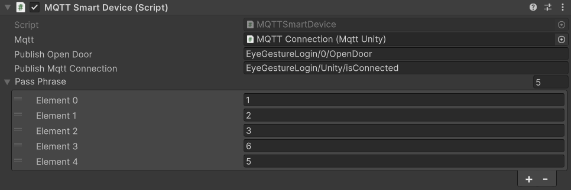
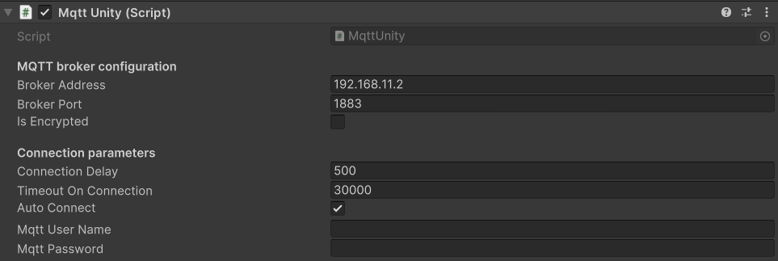
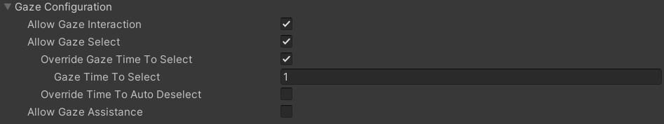
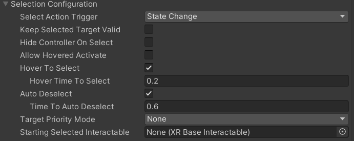
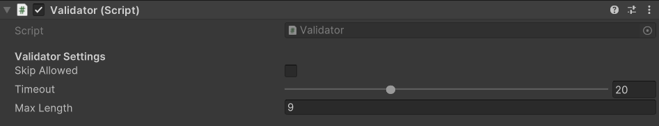

# EyeGestureLogin

## Setup
1. Install Unity
2. In Unity open the project ./Unity/EyeGestureLogin
3. Install a MQTT Broker e.g Mosquitto on a device that is reachable from the microcontroller and the unity application
4. Configure the Mosquitto (make sure that it is reachable from other devices; an example configuration is found at the bottom of this ReadMe)
5. Look at the readme for the microcontroller at ./Arduino/EyeGestureLogin/README.md and perform the described steps there
6. Go back into the Unity scene (Assets/Scenes/EyeGestureLoginDemo)
7. In Unity set the MQTT configuration in the GameObjects Hierarchy. Navigate to "Smart Devices/Connectors/MQTT Connection"
8. In the MQTT connection set the MQTT credentials, the port and IP adress of the Mosquitto Broker
9. For the VIVE XR Elite Headset install VIVE Business Streaming
10. To enable the MR with passthrough for PCVR go to VIVE Business Streaming -> Settings Icon -> Graphics and enable the option MR with passthrough.

11. You have done the setup, have fun testing the prototype!

## Settings
#### MQTT Smart Device
The MQTT Smart Device object contains the the passcode setting.  
- ```Publish Open Door```: The mqtt topic where the microcontroller listen to. Must be the same on Unity and Arduino side.
- ```Publish Mqtt Connection```: Keep this setting equal on all smart devices, used to check if the Unity Application is connected.
- ```Pass Phrase```: Password of this smart device. The passcode consits of digits of 1...9 and can have a different length. Enter the passcode as a integer list.
  
#### MQTT Connection:
- ```Broker Address```: Address of the MQTT broker
- ```Broker Port```: Port of the MQTT broker
- ```Auto Connect```: Must be enabled to connect to Unity. Deactivate this to test the application, because it will freeze for a few seconds on start up if the MQTT broker is not reachable.

#### Dwell time settings:
The dwell time is the time that is needed to select one object / interactable by gaze.
##### LoginPoint dwell time:
Go to "Smart Devices/MQTT Smart Device/Lock" and then to the Component  "XR Simple Interactable" and expand "Gaze Configuration" and set the ```Gaze Time To Select``` to the desired time in seconds.
 
##### First Entered Digit dwell time:
Go to "XR Setup/XR Origin/Main Camera/EyePatternInteractables/*" and then to the Component  "XR Simple Interactable" and expand "Gaze Configuration" and set the ```Gaze Time To Select``` to the desired time in seconds.
##### Other Entered Digits dwell time:
Go to "XR Setup/XR Origin/Main Camera/Gaze Interactor" and then to the Component  "XR Gaze Interactor" and expand "Selection Configuration" and set the ```Hover Time To Select``` to the desired time in seconds.
 
##### Validator Settings
- ```Timeout```: Defines the maximum duration [s] of no new input during the login process until it gets rejected. 
- ```Skip Allowed```: false: skipped fields get selected automatically. true: only the selected fields count
- ```Max Length```: Change only if the pattern will increase in size. Must be the the amout of SingleGazePoints-1.



## Example Broker Settings
To allow the access from other devices onto the mosquitto broker, create a mosquitto.conf file in the mosquitto installation dir with the following content:
```
listener 1883 0.0.0.0
allow_anonymous true
```
